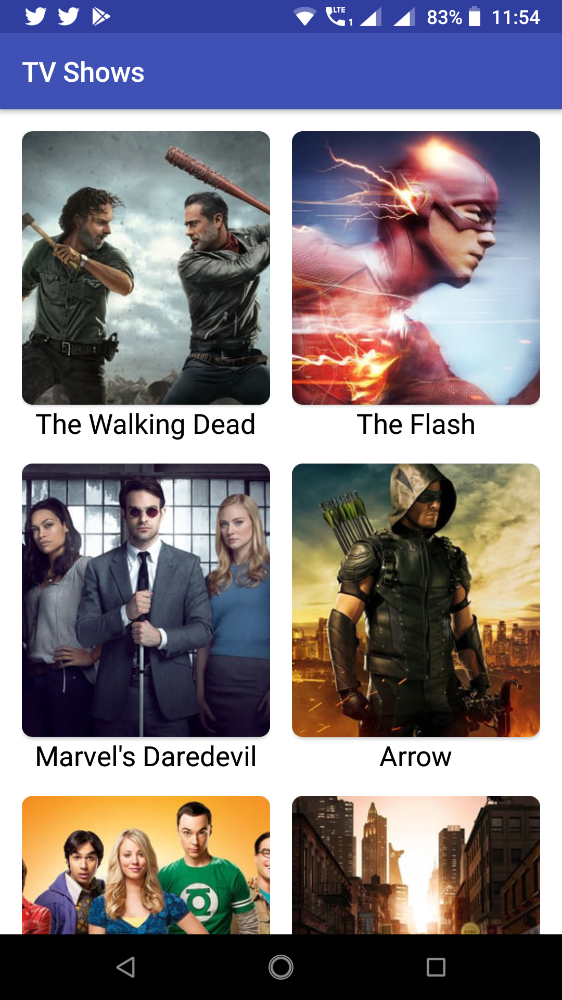
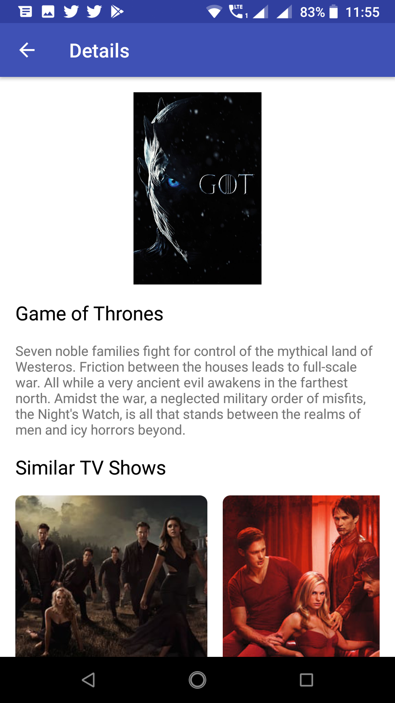

# Popular-Tv-Shows

A simple Android app, that helps users to discover popular Tv Shows. 

Please enter your API Key in the 16th line of build.gradle file :
```
buildConfigField "String", "API_KEY", '"YOUR_API_KEY"'
```


## Screenshots


